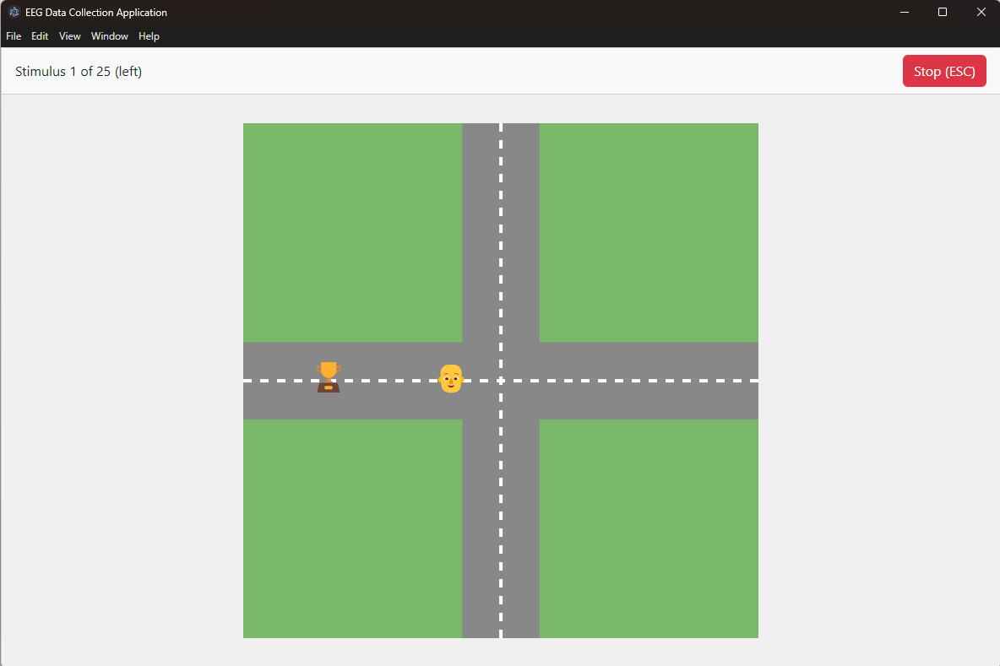
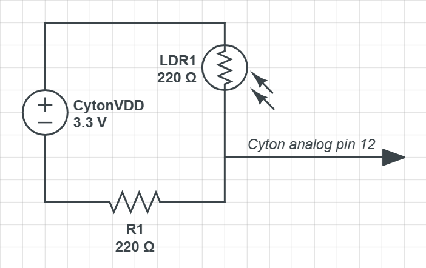

# EEG Training Data Collection Application

## Table of Contents

- [Overview](#overview)
- [Neuroscientific Basis](#neuroscientific-basis)
  - [Motor Imagery vs. Language Processing](#motor-imagery-vs-language-processing)
  - [Why Visual Scenarios?](#why-visual-scenarios)
- [Features](#features)
- [System Architecture](#system-architecture)
  - [Electron Application Structure](#electron-application-structure)
  - [Key Components](#key-components)
- [EEG Data Collection Process](#eeg-data-collection-process)
  - [Experiment Flow](#experiment-flow)
  - [Visual Stimuli](#visual-stimuli)
  - [Trigger System](#trigger-system)
- [EEG Data Processing](#eeg-data-processing)
  - [Integration with OpenBCI](#integration-with-openbci)
  - [Electrode Placement](#electrode-placement)
  - [Trigger Detection Circuit](#trigger-detection-circuit)
  - [File Processing Pipeline](#file-processing-pipeline)
  - [Data File Structure](#data-file-structure)
- [Getting Started](#getting-started)
  - [Prerequisites](#prerequisites)
  - [Installation](#installation)
  - [Running the Application](#running-the-application)
  - [Data Collection Protocol](#data-collection-protocol)
- [Troubleshooting](#troubleshooting)
  - [Common Issues](#common-issues)
  - [EEG Processing Notes](#eeg-processing-notes)
- [Development](#development)
  - [Project Structure](#project-structure)
  - [Architecture Design Rationale](#architecture-design-rationale)
  - [Adding New Features](#adding-new-features)
  - [Transfer Learning Pipeline](#transfer-learning-pipeline)
  - [Adding New EEG Analysis Features](#adding-new-eeg-analysis-features)
- [Contributing](#contributing)
- [License](#license)
- [Acknowledgments](#acknowledgments)

## Overview

This application is designed to collect EEG (Electroencephalogram) data for brain-computer interface development. It presents visual stimuli to participants and records their brain activity while they think about directional commands (forward, backward, left, right, or stop). The collected data will be used for transfer learning to analyze brain activity in real-time and control a small robot.

The application uses Electron for cross-platform desktop support and integrates with OpenBCI hardware for EEG data collection. The goal is to create a dataset that can be used to train machine learning models to interpret movement intentions directly from brain signals.

## Neuroscientific Basis

### Motor Imagery vs. Language Processing

The application is deliberately designed to engage brain regions associated with motor planning rather than language processing. This is why the stimuli are presented as visual scenarios requiring directional thinking, rather than using text instructions like "think about moving forward."

#### Key Neural Areas Targeted:

| Brain Region | Location | Function |
|--------------|----------|----------|
| Primary Motor Cortex | Precentral gyrus | Execution of voluntary movements; active during motor imagery |
| Premotor Cortex & SMA | Anterior to primary motor cortex | Motor planning and preparation; active when imagining movement |
| Posterior Parietal Cortex | Posterior parietal lobe | Spatial processing and sensorimotor integration |

#### Neural Areas Avoided:

| Brain Region | Location | Function |
|--------------|----------|----------|
| Wernicke's Area | Posterior superior temporal gyrus | Language comprehension |
| Broca's Area | Inferior frontal gyrus | Speech production and language processing |

### Why Visual Scenarios?

The intersection scenario with rewards in different directions encourages participants to:

1. **Engage in Spatial Thinking**: Activating the posterior parietal cortex and dorsolateral prefrontal cortex
   
2. **Imagine Movement**: Triggering activity in the premotor cortex and SMA even without actual physical movement
   
3. **Form Motor Intentions**: Creating distinct neural patterns in the motor planning regions that can be detected via EEG

These neural patterns are more distinct and consistent across individuals when elicited through spatial-motor imagery rather than through verbal or text-based instructions, making them better candidates for machine learning classification.



## Features

- **Visual Stimulus Presentation**: Displays a 4-way intersection with directional cues
- **Configurable Experiment Parameters**: Adjustable number of trials and timing
- **EEG Data Processing**: Integration with OpenBCI hardware and data processing
- **Automatic Data Synchronization**: Visual triggers for EEG data alignment
- **Data Organization**: Automated file management and organization by stimulus type

## System Architecture

### Electron Application Structure

The application is built using Electron, React, and TypeScript with the following components:

- **Main Process** (`main.ts`): Manages application lifecycle, window creation, and IPC handlers
- **Renderer Process** (`*.tsx` files): React components for the user interface
- **IPC Communication**: Handles data flow between UI and system operations
- **Python Integration**: Processes raw EEG data files using the external `eeg_processor.py` script

### Key Components

1. **Configuration Panel**: Set up participant information and experiment parameters
2. **Stimulus Display**: Present visual cues for directional commands
3. **EEG Data Processor**: Process raw EEG data and align with stimulus timing
4. **Data Export**: Save organized session data for later analysis

## EEG Data Collection Process

### Experiment Flow

1. **Setup**: Enter participant ID and configure stimulus parameters
2. **Instructions**: Participant reads instructions for the experiment
3. **Countdown**: 5-second countdown before experiment begins
4. **Stimulus Presentation**: Series of randomized directional stimuli
5. **Data Processing**: Run `eeg_processor.py` and process the OpenBCI EEG data file with the acquired participant data
6. **Completion**: Summary and preparation for next participant

### Visual Stimuli

The application displays an intersection scene with:
- A character (🧑‍🦲) in the center
- A reward (🏆) appearing in one of the four directions (or a stop sign ⛔)
- Visual movement animation that aligns with EEG data collection

#### Neuroscientific Design Considerations

The visual stimuli were carefully designed to optimize EEG signal quality and neural specificity:

1. **Character & Reward System**: This design leverages the brain's reward-oriented attention systems. The basal ganglia and dopaminergic pathways are activated when participants anticipate the character obtaining the reward.

2. **Four-Way Intersection**: This layout was chosen to create distinct spatial representations in the right parietal lobe. The clear orthogonal directions produce more distinguishable neural patterns than arbitrary or diagonal directions.

3. **Stop Condition**: The stop sign (⛔) engages inhibitory control networks in the prefrontal cortex that are distinct from directional motor planning.

4. **Animation Timing**: The delay before movement allows collection of pre-movement EEG data that contains the neural signature of motor planning.

5. **Clean Visual Design**: The simple, high-contrast visuals minimize visual processing load, reducing noise in the EEG signal.

### Trigger System

The application uses a visual trigger system for synchronizing EEG data with stimuli:

- **Black Square Triggers**: A black square appears for 1 second in the bottom-right corner at specific timing events

#### Why Use Visual Triggers?

Visual triggers serve several critical purposes:

1. **Hardware Synchronization**: The black square is detected by a photosensor, creating precise voltage spikes in the data stream.

2. **Temporal Precision**: EEG data is collected continuously at high sampling rates (250Hz), making precise temporal markers essential.

3. **Automated Processing**: The distinctive patterns allow automatic identification of session boundaries and individual trials.

4. **Non-invasive Integration**: This method doesn't require modifying the OpenBCI hardware or firmware.

## EEG Data Processing

### Integration with OpenBCI

The application is designed to work with OpenBCI hardware for EEG data collection. The raw data files (`.txt` or `.csv`) are processed after the experiment.

### Electrode Placement

The application uses the international 10-20 system for electrode placement, which is the standard for EEG recordings. The Ultracortex nodes on the OpenBCI headset correspond to specific locations on this system.


Images source: https://docs.openbci.com/AddOns/Headwear/MarkIV/

#### Channel to 10-20 System Correlations

The following table shows how each channel in the OpenBCI system maps to the 10-20 system locations and their associated brain regions:

| Channel | 10-20 System | Target Brain Area | Function |
|---------|--------------|-------------------|----------|
| 1 (N1P) | Fp1 | Left prefrontal cortex | Executive functions, decision making |
| 2 (N2P) | Fp2 | Right prefrontal cortex | Executive functions (right hemisphere) |
| 3 (N3P) | C3 | Left primary motor cortex | Right-sided body movement planning |
| 4 (N4P) | C4 | Right primary motor cortex | Left-sided body movement planning |
| 5 (N5P) | P7 | Left temporal/parietal region | Language processing, visual association |
| 6 (N6P) | P8 | Right temporal/parietal region | Spatial processing, face recognition |
| 7 (N7P) | O1 | Left occipital lobe | Primary visual processing |
| 8 (N8P) | O2 | Right occipital lobe | Primary visual processing |

These correspond to the default electrode locations that the OpenBCI Graphical User Interface expects.

### Trigger Detection Circuit

A custom Light Dependent Resistor (LDR) circuit captures the visual triggers from the screen:

#### Hardware Components

- LDR (Light Dependent Resistor)
- 220 ohm pull-up resistor
- Connection to OpenBCI analog input channel

#### Circuit Configuration

The LDR circuit connects to the OpenBCI board's analog input channel to detect the black square trigger displayed on screen.



#### Circuit Operation

1. When the black square is not displayed (screen area is bright), the LDR has low resistance, causing the analog input to read a low voltage.
2. When the black square appears (screen area is dark), the LDR resistance increases, causing the analog input to read a higher voltage.
3. This voltage change creates distinct spikes in the analog channel that are detected by the EEG processing script.

#### Physical Setup

The LDR should be attached to the bottom-right corner of the screen and covered with a light shield to prevent ambient light interference.


#### Why This Approach?

The LDR circuit was chosen for several reasons:

1. **Non-invasive**: Requires no modification to the OpenBCI hardware
2. **Low cost**: Uses inexpensive, widely available components
3. **Reliable detection**: Creates clear voltage spikes that are easily distinguishable
4. **No electrical connection**: Maintains electrical isolation between computer and EEG equipment

### File Processing Pipeline

1. **Data Collection**: OpenBCI records raw EEG data during the experiment
2. **File Selection**: User selects the OpenBCI data file after experiment completion
3. **Trigger Detection**: Python script identifies triggers in the analog channel
4. **Data Segmentation**: EEG data is segmented based on stimulus events
5. **Organization**: Processed data is organized by direction (LEFT, RIGHT, FORWARD, BACKWARD, STOP)

### Data File Structure

#### Data Locations
 - Participant Data: data_collection/data/
 - Processed Data: data_collection/resources/processed_data/

#### Participant Info Files

The application generates a participant info file with the following structure:

```
Participant ID: [ID]
Session Start: [ISO timestamp]
Session End: [ISO timestamp]
Total Stimuli: [count]
Session Duration: [seconds]

Trigger Pattern Information:
- Normal Stimulus Trigger: Single flash (1000ms)

Stimulus Order:
Stimulus 1: [DIRECTION]
Stimulus 2: [DIRECTION]
...

Trial Timing Data:
Trial 1: Direction=[direction], Start=[timestamp], End=[timestamp], Duration=[seconds]
...
```

#### Processed EEG Data

The Python processor organizes data into directories by direction:
```
data_collection/resources/processed_data/
├── FORWARD/
│   └── participant_001_FORWARD_1.csv
│   └── participant_001_FORWARD_2.csv
├── BACKWARD/
│   └── participant_001_BACKWARD_1.csv
├── LEFT/
│   └── participant_001_LEFT_1.csv
├── RIGHT/
│   └── participant_001_RIGHT_1.csv
└── STOP/
    └── participant_001_STOP_1.csv
```

Each CSV/TXT file contains the EEG data for a specific stimulus with added columns for direction and trial number.

## Getting Started

### Prerequisites

- Node.js and npm
- Python 3.6+
- OpenBCI hardware and software

### Installation

1. Clone the repository
```
git clone https://github.com/yourusername/eeg-training-app.git
cd eeg-training-app
```

2. Install dependencies
```
npm install
```

3. Install Python dependencies
```
pip install pandas numpy
```

### Running the Application

1. Start the development server (adequate for data collection):
```
npm run dev
```

### Data Collection Protocol

1. Connect the OpenBCI headset according to the manufacturer's instructions
2. Start recording in the OpenBCI software
3. Launch the EEG Training Application
4. Enter participant information and configure trial settings
5. Run through the stimulus presentation
6. After completion, run `resources/eeg_processor.py` for processing
    - Select the appropriate participant and eeg data files based on the trial.
    - Set the threshold values (10 - 40 are the defaults based on testing)
    - Verify in the console that the script detected the correct number of triggers and that the data was processed appropriately
7. Check `resources/processed_data` for the organized EEG data files

## Troubleshooting

### Common Issues

- **Trigger Detection Issues**: Check that the analog channel is properly connected
- **OpenBCI Channels Railed**: Ensure that all electrodes are making sufficient contact with the participant's skull, grounding clips are attached to the participant's ears, and that all wires are connected completely

### EEG Processing Notes

- The processor automatically attempts to detect the delimiter in the OpenBCI file
- It uses the Analog Channel 1 for trigger detection
- If the expected number of triggers isn't detected, it will estimate trigger locations

#### Why These Processing Decisions Matter

1. **Automatic Delimiter Detection**: OpenBCI software can export data with different delimiters depending on version and export settings. Automatic detection increases robustness.

2. **Analog Channel Usage**: Using the analog channel provides better temporal resolution and allows for capturing varying trigger intensities.

3. **Fallback Estimation**: The fallback mechanism prevents complete data loss when minor hardware problems occur.

4. **Data Segmentation Strategy**: Organizing data by direction facilitates machine learning training.

5. **Participant-Centric File Naming**: Including participant IDs supports both individual analysis and aggregation across participants.

## Development

### Architecture Design Rationale

The project structure follows specific design principles for EEG research applications:

1. **Separation of Concerns**: 
   - **Electron/** contains all system-level operations, isolating them from the UI
   - **src/** contains purely UI components, making them testable in isolation
   - **resources/** contains the Python processing script, kept separate from the JavaScript codebase

2. **Component-Based Design**: Each UI element is a separate component with clear responsibilities.

3. **Data Flow Architecture**: The application follows a unidirectional data flow pattern, where:
   - Configuration settings flow down from parent components
   - Events flow up through callbacks
   - This prevents state synchronization issues that could affect timing precision

### Adding New Features

- **New Stimulus Types**: Modify the `DIRECTIONS` constant in `constants.ts`
- **Additional EEG Analysis**: Extend the Python processing script
- **UI Customization**: Update the React components in the `src` directory

### Transfer Learning Pipeline

This application is part of a larger transfer learning pipeline for brain-computer interfaces:

1. **Data Collection (This App)**: Collects structured, labeled EEG data samples
2. **Preprocessing**: The collected data undergoes additional cleaning and feature extraction
3. **Model Training**: A base model is trained on the larger dataset
4. **Transfer Learning**: The base model is fine-tuned with individual participant data
5. **Real-time Control**: The fine-tuned model is deployed for real-time robot control

When extending this application, consider how changes will affect downstream components in this pipeline.

### Adding New EEG Analysis Features

When extending the Python EEG processor, consider implementing:

1. **Additional Frequency Band Analysis**: Add extraction of standard EEG bands
2. **Spatial Filtering**: Implement Common Spatial Pattern (CSP) filtering
3. **Artifact Rejection**: Enhance the automatic detection of eye blinks and muscle artifacts

## Contributing

Contributions to improve the application are welcome. Please follow these steps:

1. Fork the repository
2. Create a feature branch (`git checkout -b feature/amazing-feature`)
3. Commit your changes (`git commit -m 'Add some amazing feature'`)
4. Push to the branch (`git push origin feature/amazing-feature`)
5. Open a Pull Request

## License

This project is licensed under the **MIT License**:

```
MIT License

Copyright (c) 2025 Vincent Gruse and Emmanuel Taylor, Towson University

Permission is hereby granted, free of charge, to any person obtaining a copy
of this software and associated documentation files (the "Software"), to deal
in the Software without restriction, including without limitation the rights
to use, copy, modify, merge, publish, distribute, sublicense, and/or sell
copies of the Software, and to permit persons to whom the Software is
furnished to do so, subject to the following conditions:

The above copyright notice and this permission notice shall be included in all
copies or substantial portions of the Software.

THE SOFTWARE IS PROVIDED "AS IS", WITHOUT WARRANTY OF ANY KIND, EXPRESS OR
IMPLIED, INCLUDING BUT NOT LIMITED TO THE WARRANTIES OF MERCHANTABILITY,
FITNESS FOR A PARTICULAR PURPOSE AND NONINFRINGEMENT. IN NO EVENT SHALL THE
AUTHORS OR COPYRIGHT HOLDERS BE LIABLE FOR ANY CLAIM, DAMAGES OR OTHER
LIABILITY, WHETHER IN AN ACTION OF CONTRACT, TORT OR OTHERWISE, ARISING FROM,
OUT OF OR IN CONNECTION WITH THE SOFTWARE OR THE USE OR OTHER DEALINGS IN THE
SOFTWARE.
```

## Acknowledgments

- OpenBCI for EEG hardware and GUI software
- Electron and React for application framework
